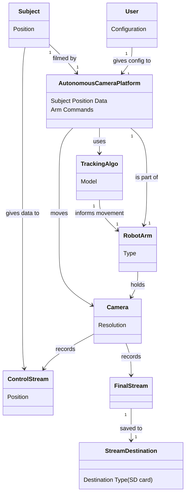

```mermaid
classDiagram
    class Subject {
        Position
    }

    class User {
        Configuration
    }

    class AutonomousCameraPlatform {
        Subject Position Data
        Arm Commands
    }

    class TrackingAlgo {
        Model
    }

    class RobotArm {
        Type
    }

    class Camera {
        Resolution
    }

    class ControlStream {
        Position
    }

    class FinalStream {
    }

    class StreamDestination {
        Destination Type (SD card)
    }

    %% Associations
    Subject "1" --> "1" AutonomousCameraPlatform : filmed by
    Subject --> ControlStream : gives data to
    User "1" --> "1" AutonomousCameraPlatform : gives config to
    AutonomousCameraPlatform --> TrackingAlgo : uses
    TrackingAlgo "1" --> "1" RobotArm : informs movement
    AutonomousCameraPlatform "1" --> "1" RobotArm : is part of
    AutonomousCameraPlatform --> Camera : moves
    RobotArm --> Camera : holds
    Camera --> ControlStream : records
    Camera --> FinalStream : records
    FinalStream "1" --> "1" StreamDestination : saved to
```

