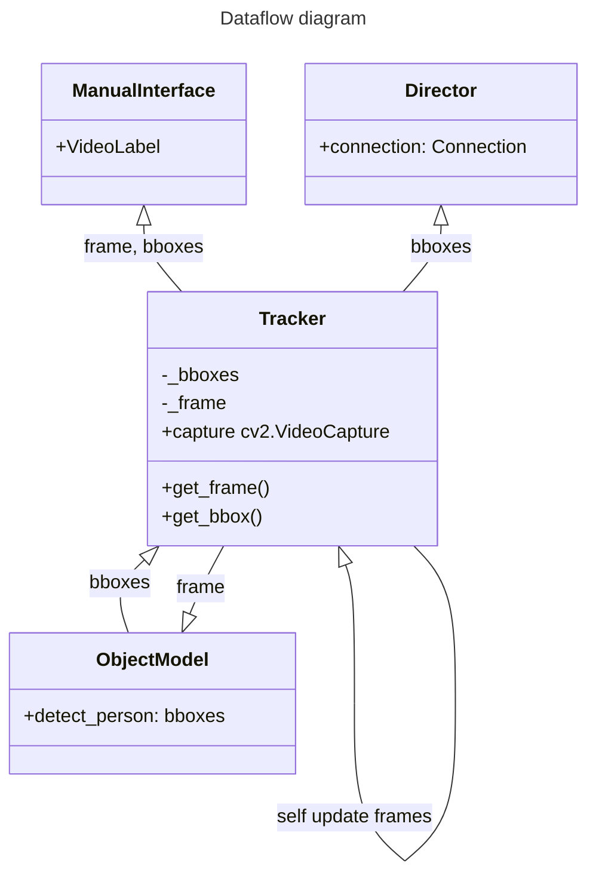
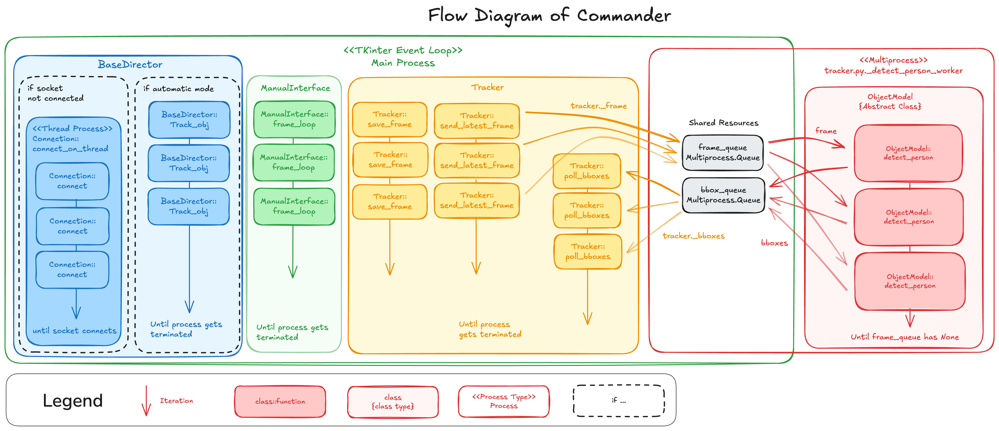

## What is Commander

Commander is a GUI application that lets us use the local device's camera to run a object detection model. Once the object is detected in frame, we can turn on the automatic control mode, and let the application send commands to the operator running on the robot's raspberry PI.

## GUI

> [!NOTE] 
> Tkinter is installed by default by python, but there could be some issues especially using the uv python package manager. See solutions in README.md in commander.

The application uses Tkinter to display GUI. While its great that tkinter comes with the python installation, but like any UI library it comes with its own event loop management. This is great for when you would like to have a simple native application, but if tasks needs to be separated into multiple processes and need to manage cleanup it can get nasty. This architecture is the result of such issue. You may see a lot of explanation focusing on runtime management and how to schedule tasks, this is the reason why. 

## Scheduler class

Scheduler class is the first result of such "solution". The scheduler allows us to indirectly pass root window reference to other sub classes that may need to make its own separate tasks. 

> [!NOTE] 
> This section require one's understanding of event loops. If you need to understand the concept of single threaded event loops there are great video explaining the event loop for internet browsers. While Tkinter does not have all of the browser's robust event loop management system, it's core idea and limitations are the same. More on this below...
> https://youtu.be/8aGhZQkoFbQ?si=UE6x9rQTU1pMTLBI
> https://youtu.be/eiC58R16hb8?si=TyC6C3gUlo1aaRfM 
### Why this is useful
We have several classes that needs to run its subprocess as a background tasks. While most of these tasks are a single while loop, its generally bad idea to have the while loop run on the main process because it would block the UI until the loop finishes. This causes UI to freeze and all of their inputs and interactions will be blocked, and other processes like updating video frame on screen or running detection model could also be blocked from further processing. 
This is where scheduler is used. Instead of having the following code:
```python
def process(self):
	while self.is_running:
		# Do some process
```
We turn it into a recursive method.
```python
def process(self):
	# Do some process
	if self.is_running:
		self.scheduler.set_timeout(100, self.process)
```
This allows us to release the main process and schedule the same process function to run after 100 ms. This means that while this process is not running for that 100 ms, the main process is freed and other process can run their own tasks. I would recommend not putting 0 for ms because it can over load the event loop and take over the entire eventloop; if you are doing this or have a small delay, I would make sure that the function is very short and fast, shorter the better.

### set_interval method
If you would just like to continuously call a process over and over again, we can also use set_interval. This is great especially if you would like to have a set timeout be called exactly the correct ms interval. Make sure that the method call is shorter than the sleep ms or else we would also over load the eventloop. 

This method will return a IterativeTask object that can then be canceled using `task.cancel()`.

## Longer background tasks
While eventloop is great for small UI microinteractions, but if we want to do anything that will take a second or longer, we want to break it into a separate process. This is where we will use Threading and multiprocessing. 

### Threading
This is a simple method for offloading tasks into a background task, where you want to just run a simple while loop in a thread for it to end eventually. This is used for Connection class where it will try to connect to operator using loops. This is great if you would want to use the same main process for just calling a method over and over again.

### Multiprocess
This is a more difficult solution for breaking task out into a completely different process. This is great for things that take massive amount of time or resources to compute. We use this for ObjectModel where it needs to run object detection algorithms. If you are using this please be careful of the next topic. 

### Termination Handling
Once the task is started on Multiprocess or Threading we will need a method to clean up. One way to ensure clean up for threading is passing the daemon param like so
```python
threading.Thread(target=self.connect, daemon=True)
```
This will ensure that when the main process ends, the threads will also be terminated. 
There is also same thing for multiprocess:
```python
multiprocessing.Process(
	target=_detect_person_worker,
	args=(self.model, self._frame_queue, self._bbox_queue),
	daemon=True,
)
```

Now this works well enough, but sometimes this is still not enough especially with Queues. These will need a specific call back to be called to close during termination. This is where we use `add_termination_handler(handler)`. This will register callback such that it will be called on termination. 
> See Tracker class for example of how to use this.

## Issues I have faced
I had several issues when handling termination.
- TKinter overrides the termination handler. This could be that Tkinter runs on a new process after initialization, but the termination did not always work. The solution for this was that I had to move the initialization of termination handler into the manual interface initialization. That seems to work more reliably.
- This especially became a problem when closing the application because if the user clicks on the x button on the window, the termination handler will be triggered from the tkinter side in which the termination handler will not be called. If the termination process is subscribed to window close event, the signal termination in the terminal becomes a problem because the tkinter window close handler is going to be called twice. Termination handler now has a remove method to delete used handlers to fix this problem. 

# Tracker Class

Tracker class currently acts as a state object for data distribution. From Tracker, 3 classes are polling latest data. 
1. Manual Interface
	1. Polls frames and bounding boxes to update the display frames. If the bounding box is not yet calculated it will only display frames.
2. Director
	1. Polls bounding boxes to determine which commands to send to operator.
	2. Currently we are [polling frames to get shape data](https://github.com/talos-rit/commander/issues/116), but this is being removed soon. 
3. Object Model(tracker pushes into object model's process queue)
	1. The tracker queues up the latest frame into the model. The queue has a max size of 1, so only the latest frame ill be queued.

Note that the ManualInterface class is the initiator of UI for Talos, but ManualInterface will not be required to start the rest of the background tasks for Tracker, Director, and ObjectModel. Instead tracker class will act as a initiator for rest of the application tasks. See Tracker.\_\_init\_\_().



## Concurrent Processes

This is the overall system flow diagram of commander when ManualInterface is running. 


link: https://excalidraw.com/#json=R1vgjL8J8xnGoYC_HBg2d,fTWG8Xhsb7a3OFAg49wysA

Process List by Type:
1. Eventloop
	1. Director::track_obj -- this is the process to send command to operator using Connection
	2. ManualInterface::frame_loop -- this process updates UI's frame
	3. Tracker::save_frame -- this poll's video frames from video capture
	4. Tracker::send_latest_frame -- this pushes frames into shared resource to let object detection get access to the frame
	5. Tracker::poll_bboxes -- this polls latest bboxes sent from ObjectModel
2. Threads
	1. Connection::connect_on_thread -- this attempts to connect to operator on the raspberry pi and continues until the connection is successfully made
	2. (Not diagramed)ManualInterface::stop_move -- this allows continuous inputs to operator
3. Multiprocess
	1. ObjectModel::detect_person -- this polls from the frame_queue and returns a boundary boxes into bbox_queue

The recommended factor to pick between each concurrency method is the following:
![[concurrency_decision_graph.svg]]

Several watch out with each:
- Event loop
	- Currently the scheduler's iterate task class has no protection with over scheduling tasks. It is heavily recommended that the developer stay aware of the duration of the function calls and decide to switch to other method if necessary or decrease the call rate.
	- While clean up is not necessary for scheduler class, it is recommended in case you decide to terminate the logic without fully closing the application. Or the order to which the termination is necessary(not currently implemented).
- Threads
	- You can throw the concurrent logic into threads and make it work, but be aware that rigorous clean up logic should still be maintained.
- Multiprocess
	- Pickling may be problematic depending on the parameter that is required, if you are having trouble pickling the parameters of the logic, I would recommend going back to threads for the time being. 
	- Be aware of unterminated processes, this project has seen segfaults in python due to unforeseen behavior of the gc. 
## Detection and control mode interaction


> [!BUG]
> Currently there is a bug with the logic for swapping object detection model where if the model is swapped, the detection process is started regardless of what the previous process state was.

