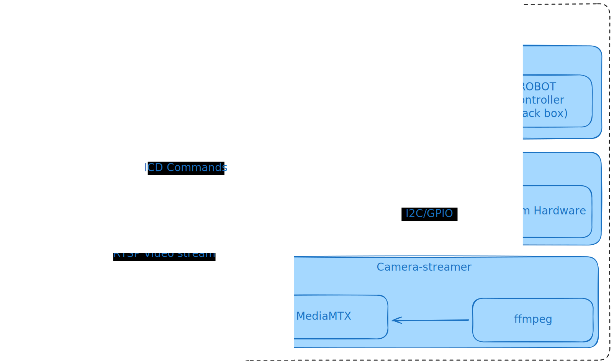

# System Diagram

link: https://excalidraw.com/#json=0fau5jFH_JJv4sWhGhX2U,l0_vn3LakCDKX8yQYBqMJA

The Talos system has three major subsystems:
1. Commander
2. Operator
3. Camera Streamer

Operator is the only application that is strictly restricted to running on the Raspberry Pi. The other applications can run anywhere. For example, commander can run on the server with GPU, and camera streamer can run on a simple streaming device separate from robot's Raspberry Pi. Commander does not restrict us from pulling video from another source, so this is a completely valid setup. For the time being we are not exhausting resources on the Raspberry Pi, so we are directly streaming out from the Raspberry Pi. 
# [Commander Architecture](commander_architecture)
Commander is a python controller application that is executed on wide range of operating systems. It can even be run on the Raspberry Pi of the robot. See the architecture doc for more information.

Repository: https://github.com/talos-rit/commander
# Operator Architecture

Operator is a receiver end of the commander controller. 

Repository: https://github.com/talos-rit/operator
# Camera Streamer

Camera streamer consist of two separate services:
1. MediaMTX
	- MediaMTX manages client and source connections and allows wide variety of connection types. This allows us to fetch video streams from commander using open-cv2, OBS using ffmpeg, or even a web ui. 
2. Ffmpeg
	- ffmpeg pulls camera frames from web cam on the raspberry pi or any camera source.

Repository: https://github.com/talos-rit/cam_streamer
