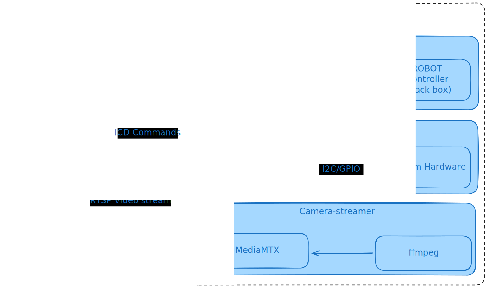

# System Diagram

link: https://excalidraw.com/#json=-4swq3L3L2yZn0jzfnopY,OjSybXvI3JqcrL6LNbakaw

The Talos system has four major subsystems:
1. Commander
2. Operator (ER-V only)
3. ESP Driver (ER-4pc only)
4. Camera Streamer

Operator is strictly restricted to running on the Raspberry Pi. ESP-Driver must run on an ESP32. The other applications can run anywhere. For example, commander can run on the server with GPU, and camera streamer can run on a simple streaming device separate from robot's Raspberry Pi. Commander does not restrict us from pulling video from another source, so this is a completely valid setup. For the time being we are not exhausting resources on the Raspberry Pi, so we are directly streaming out from the Raspberry Pi. We also for ease of use have been running commander off of a laptop.

# [Commander Architecture](commander_architecture.md)
Commander is a python controller application that is executed on wide range of operating systems. It can even be run on the Raspberry Pi of the robot. At the most basic level it takes the camera feed, interprets where the robot must move and sends commands to the robot over a socket connection. See the architecture doc for more information.

Repository: https://github.com/talos-rit/commander

# [Operator Architecture](operator_architecture.md)
Operator is on the receiving end of commander. It processes commands, converts them to serial commands compatible for the robot controller to understand, and sends them to the robot

Repository: https://github.com/talos-rit/operator

# [ESP Driver Architecture](esp_driver_architecture.md)
ESP Driver is also on the receiving end of commander. It is compatible on the same protocol used by Operator. The difference is this is all bare metal and runs on an ESP32, and controls the hardware over GPIO pins/I2C.

Repository: https://github.com/talos-rit/esp-driver

# [ICD Commands](ICD%20API.md)
This is the TCP socket protocol used to communicate between Commander and Operator/ESP Driver. More info on the format of the data can be found in the linked document. Note, this document outlines the full future spec, not every command is implemented.

# [Camera Streamer](https://github.com/talos-rit/cam_streamer)

This is an installer and setup guide for two services on raspberry pi running linux(ubuntu or Raspberry Pi OS). It packages the following services: MediaMTX and Ffmpeg. This is so that we can reliably start up the webcam on startup and keep the stream open for the entire duration that the robot is turned on.

Repository: https://github.com/talos-rit/cam_streamer
