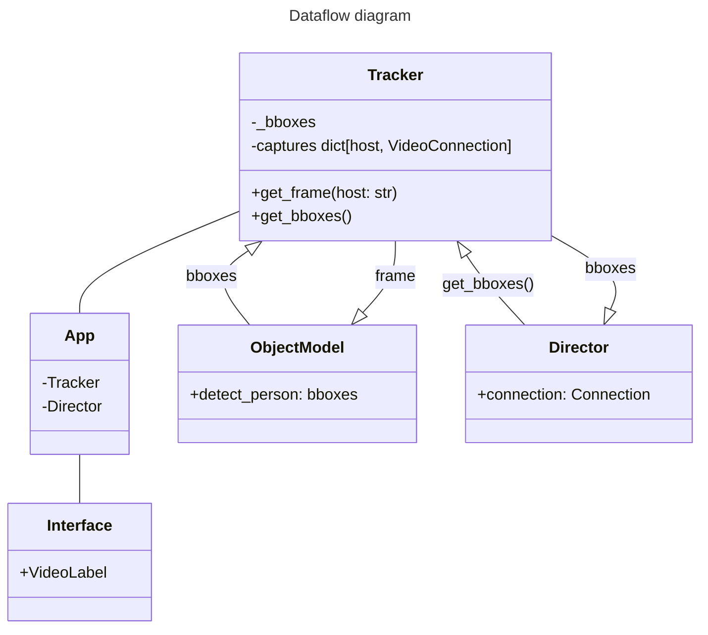
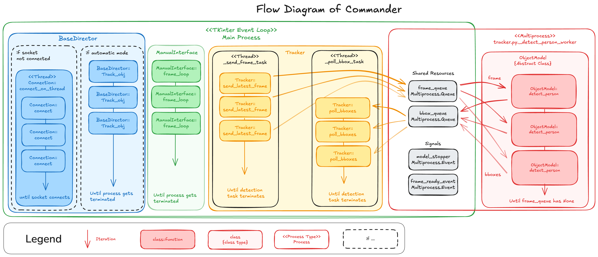
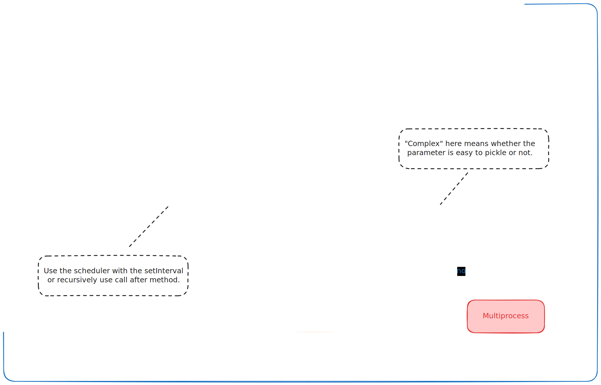

Contents:
- [[#What is Commander|What is Commander]]
- [[#GUI|GUI]]
- [[#TUI|TUI]]
- [[#Scheduler class|Scheduler class]]
	- [[#Scheduler class#Why this is useful|Why this is useful]]
	- [[#Scheduler class#set_interval method|set_interval method]]
	- [[#Scheduler class#Architectural decision|Architectural decision]]
- [[#Longer background tasks|Longer background tasks]]
	- [[#Longer background tasks#Threading|Threading]]
	- [[#Longer background tasks#Multiprocess|Multiprocess]]
	- [[#Longer background tasks#Termination Handling|Termination Handling]]
- [[#Issues I have faced|Issues I have faced]]
- [[#Concurrent Processes|Concurrent Processes]]
- [[#Detection and control mode interaction|Detection and control mode interaction]]
- [[#MVC architecture|MVC architecture]]
	- [[#MVC architecture#View|View]]
	- [[#MVC architecture#Controller|Controller]]
	- [[#MVC architecture#Model|Model]]

## What is Commander

Commander is a GUI application that lets us use the local device's camera to run a object detection model. Once the object is detected in frame, we can turn on the automatic control mode, and let the application send commands to the operator running on the robot's raspberry PI.

# Architecture
One of the main architectural decision we made was the facade design pattern using the App class. In `talos_app.py` we have the App class which is a single point of control for the entire backend of commander. This merges several control behavior logic in the backend classes like Tracker, Director, Connection, and Publisher. The app class acts as a single bridge of User interface logics and the backend. This was necessary due to the interest of adding another interface option with a potentially completely different runtime and process behavior. Thus extracting backend logic from the user interface logic was necessary to make this transition process easier.

## GUI

> [!NOTE] 
> Tkinter is installed by default by python, but there could be some issues especially using the uv python package manager. See solutions in README.md in commander.

The application uses Tkinter to display the GUI. While it's great that tkinter comes with the python installation, like any UI library it comes with its own event loop management as well. This is great for when you would like to have a simple native application, but if tasks needs to be separated into multiple processes and you need to manage cleanup it can get nasty. This architecture attempts to solve this issue. You may see a lot of explanation focusing on runtime management and how to schedule tasks, this is the reason why. 

## TUI

The no interface option is also possible to be developed or tested in the terminal via the `-t` flag. This allows us to also run the commander in a no graphical environment like the container or server. The application uses python [textul UI](https://github.com/talos-rit/project_documentation/blob/master/technical/architecture/Commander%20Architecture.md). This is still a interactive interface and the buttons, dropdown menu, and logger is interactive with a mouse. There are also several keyboard shortcut available and can be searched via the ctrl+p shortcut. 

> [!NOTE]
> This is still under development in [#168](https://github.com/talos-rit/commander/pull/168)
> and is planned to be merged in milestone 2.

## Scheduler class

Scheduler class is the first part of such a solution. The scheduler is an abstract class that allows us to indirectly pass task scheduling logic reference to other sub classes that may need to perform tasks separately in the main loop.

> [!NOTE] 
> This section require one's understanding of event loops. If you need to understand the concept of single threaded event loops there are great videos explaining the event loop for internet browsers. While Tkinter does not have all of the browser's robust event loop management system, it's core idea and limitations are the same. More on this below...
> https://youtu.be/8aGhZQkoFbQ?si=UE6x9rQTU1pMTLBI
> https://youtu.be/eiC58R16hb8?si=TyC6C3gUlo1aaRfM 
### Why this is useful
We have several classes that need to run their subprocesses as a background tasks. While most of these tasks are single while loops, its generally bad idea to have the loop run on the main process because it would block the UI until it finishes. This causes UI to freeze and all of their inputs and interactions will be blocked, and other processes like updating the video frame on screen or running the detection model could also be blocked from further processing. 
This is where scheduler is used. Instead of having the following code:
```python
def process(self):
	while self.is_running:
		# Do some process
```
We turn it into a recursive method.
```python
def process(self):
	# Do some process
	if self.is_running:
		self.scheduler.set_timeout(100, self.process)
```
This allows us to release the main process and schedule the same process function to run after 100 ms. This means that while this process won't run for 100 ms, the main process is free and other process can run their own tasks. I would recommend not putting 0 for ms when using set_timeout recursively, because it can over load the event loop and take over the entire eventloop; if you are doing this or have a small delay, make sure that the function is very short and fast.

### set_interval method
If you would just like to continuously call a process over and over again, we can also use set_interval, which automatically sets up the recursive callback structure I just described. This is great especially if you would like to have a set timeout be called with exactly the correct interval. Make sure that the method call is shorter than the interval or else we would also over load the eventloop. This method will return a IterativeTask object that can then be canceled using `task.cancel()`.

### Architectural decision
Scheduler is an abstract class for the backend because it is the only class that needs to cross the frontend/backend border. This is because scheduling logic is defined by the user interface frameworks and can not be initiated by the backend. This is also the reason why the frontend is always initiated before the backend and the frontend owns the backend. While we could have not given an option to use the eventloop as a concurrency technique in the backend via threads, eventloops are a much more predictable and less overhead with concurrency. This means we do not have to create thread locks to prevent race conditions because eventloop guarantee single execution.

## Longer background tasks
The Eventloop is great for small UI microinteractions, but if we want to do anything that will take a second or longer we should to break it into a separate thread or core process. This is where we will use Threading and Multiprocessing. 

### Threading
This is a simple method for offloading tasks into the background, where you want to just run a simple while loop with each iteration being a long task. This is used for the Connection class when it continuously tries to connect to operator using loops. This is great if you want to use the same main process for just calling a method over and over again. Note that we are still using python 3.12 with the GIL making the threads only a single execution, but threads is an easy way of offloading tasks to a different task to unblock the main thread running the event-loop.

### Multiprocess
This is a more difficult solution for breaking task out into a completely different process. This is great for things that take a large amount of time or resources to compute. We use this for ObjectModel where it needs to run object detection algorithms where we definitely don't want it to block the main process, but we also want itself to run block free. This is a harder implementation in python because we need to spin up a completely separate python process with its own interpreter and runtime. Meaning you will need to instantiate everything that you will need in the childprocess again in the runtime of the childprocess. This also means that we will have to manage data sharing ourselves via pickling. Thankfully, the object detection is relatively isolated from other commander logic and only requires image frame as input and boundary box as the output(list of integer coordinates). The image frame uses shared memory buffer where we are continuously writing and reading off of in each process. The output boundary box uses queues and IPC method of sharing data. While its not necessary to understand how each mechanisms work, it could be great to have a general idea of how each mechanisms work. 
If you are messing with this method please be careful of the following topic:
### Termination Handling
Once the task is started with Multiprocessing or Threading we will need a method to clean up. One way to ensure clean up for threading is passing the daemon param like so
```python
threading.Thread(target=self.connect, daemon=True)
```
This will ensure that when the main process ends, the threads will also be terminated. 
There is also the same thing for multiprocessing:
```python
multiprocessing.Process(
	target=_detect_person_worker,
	args=(self.model, self._frame_queue, self._bbox_queue),
	daemon=True,
)
```

Now this works well sometimes, but with Queues this is still not enough. These will need a specific callback to be called to close during termination. This is where we use `add_termination_handler(handler)`. This will register a cleanup callback such that it will be called during the main loop termination process. 
> See the Tracker class for example of how to use this.

## Issues I have faced
I had several issues when handling termination.
- TKinter overrides the termination handler. This could be that Tkinter runs on a new process after initialization, but the termination did not always work. The solution for this was that I had to move the initialization of termination handler into the manual interface initialization. That seems to work more reliably.
- This especially became a problem when closing the application because if the user clicks on the x button on the window, the termination handler will be triggered from the tkinter side in which case the termination handler will not be called. But if the termination process is subscribed to the window close event, closing via the terminal becomes a problem because the termination handler will to be called twice. Termination handler now has a remove method to delete used handlers to fix this problem. 
- The GC accidentally deleted the shared memory used by numpy while the process is still writing into the buffer. This is an odd behavior of the numpy's internal optimization and the GC's unfortunate memory management mechanisms. This resulted in a segmentation fault in python, and the solution was holding a reference to the shared memory buffer, but not actually do anything else with it. While this will seem like a dead code, it is very necessary to prevent GC from accidentally deleting it. 

# Tracker Class

Tracker class currently acts as a state object for data distribution. From Tracker, three classes are reading data. 
1. TKInterface
	-Polls for frames and bounding boxes to update the display.
	-If the bounding boxes are not found it will only display frames.
3. Director
	-Polls for bounding boxes to determine which commands to send to operator.
5. Object Model
	-Has a process queue that tracker pushes frames to.
	-The queue has a max size of 1, so only the latest frame will be queued.

Note that the TKInterface class (in src/tk_gui/main_interface) is the initiator of UI for Talos, but TKInterface will not be required to start the rest of the background tasks for Tracker, Director, and ObjectModel. Instead the Tracker class will act as an initiator for rest of the application tasks. See Tracker.\_\_init\_\_().



## Concurrent Processes

This is the overall system flow diagram of commander when ManualInterface is running. 


link: https://excalidraw.com/#json=TYrgaMFIY22a3fWrXEuoE,_wv-jaxajN7yGfRHaKrrKA

Process List by Type:
1. Eventloop
	1. Director::track_obj -- this is the process to send commands to operator using the Connection class
	2. TKInterface::frame_loop -- this process updates the UI frame
2. Threads
	1. Connection::connect_on_thread -- this continuously attempts to connect to the operator on the raspberry pi until the connection is successful
	2. (Not diagramed)TKInterface::stop_move -- this allows continuous inputs to operator
	3. Tracker::send_latest_frame -- this pushes frames into shared memory to let object detection access them
	4. Tracker::poll_bboxes -- this polls latest bboxes sent from the ObjectModel
3. Multiprocess
	1. ObjectModel::detect_person -- this polls from the frame_queue and returns boundary boxes into bbox_queue

The recommended factor to pick between each concurrency method is the following:


Several things to watch out for with each:
- Event loop
	- Currently the scheduler's iterate task class has no protection from overscheduling tasks. It is highly recommended that the developer stay aware of the duration of function calls and switch to other methods if necessary, or decrease the call rate.
	- While clean up is not necessary for the scheduler class, it is recommended in case you decide to terminate the logic without fully closing the application, or the order in which things terminate is fixed(not currently implemented).
- Threads
	- You can throw the concurrent logic into threads and make it work, but be aware that rigorous clean up logic should still be maintained.
- Multiprocess
	- Pickling may be difficult depending on the parameter that is passed into the separate process, if you are having trouble pickling the parameters of the logic, I would recommend going back to threads for the time being. 
	- Be aware of unterminated processes, this project has seen segfaults in python due to unforeseen behavior of the garbage collector. 
## Detection and control mode interaction


## MVC architecture

While this is not regularly how we think about commander's architecture we can easily identify different sections of the commander to be classified as MVC. Since this is not how architecture was drafted for commander, the organization of the source code is not related to MVC. This could be possible, but organization via functionality has been prioritized to make this easier to maintain. 
### View
The interface classes will be the view of commander like tk_gui and textual_tui. This controls the visual aspects of the commander. Note that typically application will have only one view, but because we have a gui and tui option depending on the options, the interface class used will change.

### Controller
Considering tk_gui and textual_tui as view classes we can consider talos_app or app class to be the controller. All of the control or action a user can execute can be found here. Additionally there are also base director, scheduler, and tracker that also acts as controller. 

### Model
Models are harder to spot in commander but they still exist in a few places like IterativeTask for scheduler, Command for ICD, VideoConnection or Connection for OperatorConnection. 

