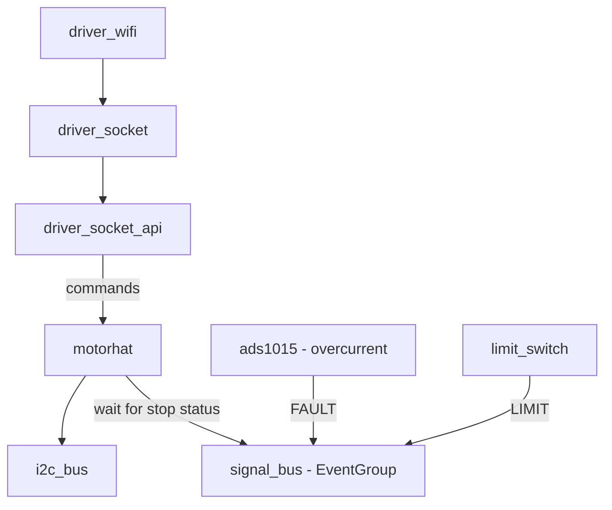

> [!warning] NOTE
> Due to the fact that we were moving to ESP32 architecture, we were moving to support operator/ACL functionalities here as well, and moving to depreciate Operator entirely.

# What is ESP Driver

ESP Driver is the embedded application designed to run on an ESP32. This project started as the requirement for more GPIO pins and faster processing without the limitations of an OS became apparent. Due to the speed and lack of pins on the Pi 4B, we moved to building on top of an ESP32. This project is an [ESP IDF](https://docs.espressif.com/projects/esp-idf/en/stable/esp32/get-started/index.html#introduction) project. ESP-IDF is the official framework built by Espressif. We decided towards this rather than the Arduino framework due to its expanded ability to configure the chip, as well as the added debugging capabilities.

# Overall Architecture
The ESP Driver application has many different sections, described below. This architecture is very tightly coupled with the hardware.

| Module                   | Description                                                                                                                                                                                       |
| ------------------------ | ------------------------------------------------------------------------------------------------------------------------------------------------------------------------------------------------- |
| main                     | Contains the main entry point to the application in app_main(). Initializes everything.                                                                                                           |
| test                     | The unit testing framework. Only modification here should be adding test groups in `test/main/esp_driver_test.c`.                                                                                 |
| components/i2c_bus       | A wrapper around the ESP i2c bus. Allows multiple components to use a single bus.                                                                                                                 |
| components/motorhat      | A driver implementation for the Adafruit MotorHAT. Includes the driver for the PCA9685 chip and a wrapper to move specific motors on the HAT.                                                     |
| components/ads1015       | A driver implementation for the Texas Instruments ADS1015 ADC. Used to fire stop events if current from motor becomes too high. (current sensing)                                                 |
| components/driver_wifi   | Component to connect the ESP to a WiFi network. Currently supports passphrase networks up to WPA3 Personal. (No enterprise/eduroam currently)                                                     |
| components/driver_socket | Implements the [talos_icd](talos_icd.md) socket spec to receive commands from commander. `driver_socket.c` is just socket setup while `driver_socket_api.c` implements actual command processing. |
| components/encoder       | Uses the ESP IDF PCNT module to implement quadrature rotary encoders, to allow knowing where the robot is located.                                                                                |
| components/limit_switch  | GPIO module for detecting limit switch when it goes LOW, fires to stop motors.                                                                                                                    |
| components/signal_bus    | Just holds a global Event/Wait group. This allows tasks to wait rather than poll. Is used by all motor events.                                                                                    |
> [!warning] NOTE
> Currently encoder is setup, tested and working, but no logic has been implemented to use it at this time.

## FreeRTOS
This framework is heavily dependent on [FreeRTOS](https://www.freertos.org/). The ESP32 has 2 cores on board, and uses the RTOS to predictably schedule tasks on the CPU. EventGroups, vTaskDelay, Queues, and much more are apart of FreecRTOS.

## Menuconfig

## I2C Bus
I2C bus just acts as a wrapper to the ESP IDF I2C Bus. It specifically wraps the [`i2c_master_bus_handle_t` type](https://docs.espressif.com/projects/esp-idf/en/stable/esp32/api-reference/peripherals/i2c.html). It is used to share the bus between multiple components. It does not wrap the methods, it allows the bus to be fetched, and does not do any verification. It trusts the components using this data are using them correctly.

## MotorHAT
There are 2 sections of this, the motorhat section, and the PCA9685 section. On the Adafruit MotorHAT, the chip that is connected to the I2C pins is the PCA9685. This chip controls multiple PWM channels, and ddirectly controls the channels directly. This should not be used directly. The motorhat section wraps the PCA9685 to the proper channels, and allows you to set the speed of the motors directly. This is the public api and is easier to use. If you are curious to more on how the MotorHAT is mapped, I would suggest looking at the [hardware_handoff](hardware_handoff.md) reference for how the PWM channels are mapped to the motor drivers.

## ADS1015
The ADS1015 module is an I2C driver for the Texas Instruments ADS1015. Currently it is designed to detect overcurrent. Due to the functionality of the ADC, we are rapidly swapping the Mux after every singleshot conversion in order to use both channels of the ADC. Currently not fully finished, as we discovered that motor current varies with speed, and requires more at startup. Due to this, the overcurrent needs to be a variable function, not a static value. Right now, it is static limits, to which if the current limits are reached, the motor will be shut off.

## Driver WiFi
This module initializes the ESP32 WiFi module and handles connecting the controller to WiFi. Currently, it supports up to WPA3 Personal (We have not gotten it to connect to RIT networks.) We were using a router to connect all the devices to commander during our development. Pulled mostly from [Espressif's example](https://github.com/espressif/esp-idf/tree/v5.5.2/examples/wifi/getting_started/station).

## Driver Socket
There are 2 parts to this module, the driver_socket, which sets up a TCP socket and accepts connections. Most of that is from [Espressif's example](https://github.com/espressif/esp-idf/tree/v5.5.2/examples/protocols/sockets/non_blocking).  The 2nd part of this module is the driver_socket_api. This section is the important section, where all socket commands from the Commander application are sent to and processed. In here the network data is decoded as per the [talos_icd](talos_icd.md), and sent off to control the motors directly.

## Encoder
Mostly based off this [example](https://github.com/espressif/esp-idf/tree/v5.5.2/examples/peripherals/pcnt/rotary_encoder), it defines one rotary encoder channel. Currently it is just setup to read in main every few milliseconds, has no actual control functionality as of now, but in the future, would aid in homing, and forming end stops. More detail is available in the [hardware_handoff](hardware_handoff.md) on why encoders are required. The encoders are quadrature encoders, [here is a decent article on how they work](https://www.dynapar.com/knowledge/encoder-basics/encoder-output/quadrature-encoders/).

## Limit Switch
Just uses the ESP IDF gpio module to fetch interrupts. When an interrupt fires, it stops the motor. In practice though, because the limits on this robot are in the middle of the range rather than the ends, they should not be used in normal operation, and should be used in homing to reset the encoders, and use the encoders to determine the end stops per motor.

## Signal Bus
Just holds a global EventGroup for the motors. It helps communicate stop signals, etc to the motorhat module to determine if a limit was hit or over current was detected.