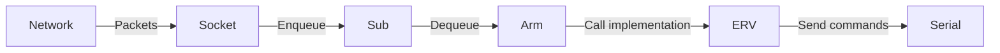

> [!warning] NOTE
> Due to the fact that we were moving to ESP32 architecture, we were moving to depreciate this entirely. It is still supported for the ER-V at this current time, but no new features have been developed.

# What is Operator

Operator is the application responsible for the communication between the [[commander_architecture|Commander]] application, and the robot itself. This application is intended to be run on a Raspberry Pi (only works on Linux systems), and plugged into the robot using a USB to Serial cable.

# Overall Architecture

The operator application has many different sections, described below

| Module        | Description                                                                       |
| ------------- | --------------------------------------------------------------------------------- |
| Socket        | Responsible for receiving packets from Commander, and sending them for processing |
| Sub           | The intermediary between the socket thread and the Arm, mostly just a queue       |
| Arm           | Contains an abstract method, calls methods overridden by sub classes              |
| Scorbot/Ichor | Arm implementations that handle controlling the robot directly                    |

The 3 threads that run are the Socket, Arm, and the Logger.

## Socket
This module opens a plain TCP socket using `sys/socket.h`. It is setup as a server and setup to receive plain bytes. The packet format is outlined in [talos_icd](talos_icd.md). Each packet is pulled from the socket, and put into a raw buffer in the Sub module. Responding to commander is not currently setup but was a feature that was discussed for future improvement. This is basically just a basic Linux net socket.

## Sub
Sub, short for Subscriber, is a module that acts as a queue mostly. It is not a true subscriber/observer pattern, though. It is mainly a custom queue. The way that it is structured, there is one pool of buffers used, which are fixed and recycled. Each buffer in the pool can belong to one of the following
* *Free*
* *Command*
* *Return*
* *Log*
Only *Free* and *Command* are currently used. Free is the default for the pool. When socket needs to put a command in the queue, it takes a buffer from the Free queue, adds the data, and puts it back into the Command queue. Then the Arm class removes from the Command queue, processes it, and returns it to the Free queue to be recycled for the next Socket command.

## Arm
Arm is an abstract class that has a few concrete methods. One is `runLoop`, which runs the code for the arm, and the other is `processCommand`.`runLoop` is the main loop for the Arm, and calls `processCommand` every loop to pull commands from the queue. The individual movement commands such as `polarPanStart` are defined in the subclasses, `Ichor` and `Scorbot` (though that class is called erv.cpp for some reason.)

## Scorbot
This is a subclass of Arm, which defines the communication logic for the original controller over a serial port. It contains a sub-module, `acl`, which converts the commands to the strings that the robot accepts. Most of the logic for moving the robot is done in manual mode, and is controlled by essentially spamming characters over serial to continue moving the robot. For more docs on the ACL language, please see [acl_reference](acl_reference.pdf).

Commands are pushed to a command buffer, and are dispatched out to the robot once every loop cycle.

## Ichor
Pretty much depreciated at this point. This module used to serve as the hardware implementation when it was built using a Raspberry Pi. Our team decided that a micro-controller, in this case an ESP32 fit our project better and was more suited to direct motor control and encoder reading. More can be found on this transition.