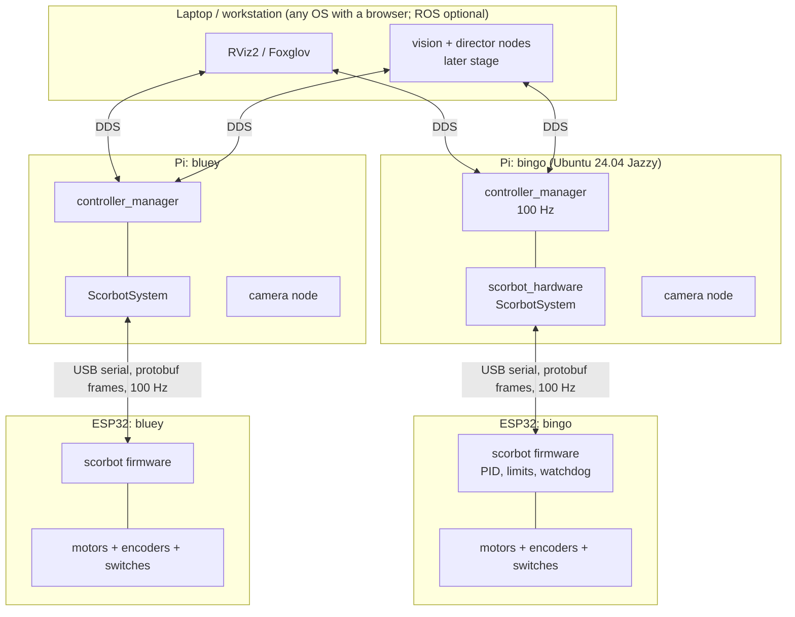
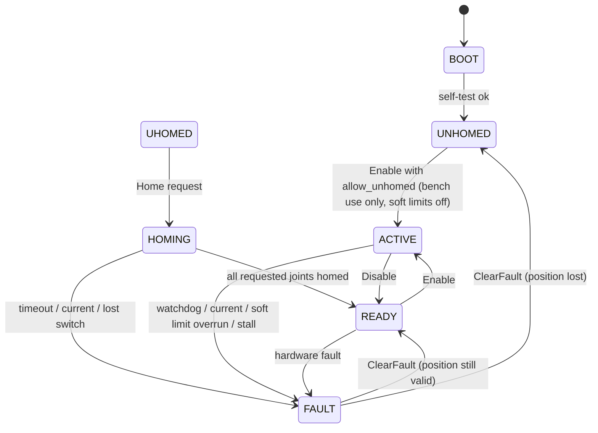

> [!NOTE] Status
> September 2026. Owner: Jacob Odle (Controls Lead). This document defined the 
> target architecture for running both Scorbots under ROS 2 Jazzy with a `ros2_control`
> hardware interface, and the Pi-to-ESP32 protocol that interface speaks. It is the
> design for the *controls track*. Vision, director and UI are not scoped within this file.

> [!WARNING] Supersedes
> This design will replace the ICD socket protocol (`ICD API.md`), the `operator`
> application and the socket layer of the `esp-driver`. Those remain in the repositories for reference.

## Contents
- [[#0. Vocabulary]]
- [[#1. Goals and non-goals]]
- [[#2. Decisions and rationale]]
- [[#3. System architecture]]
- [[#4. Repository and package layout]]
- [[#5. Robot description]]
- [[#6. Hardware interface design]]
- [[#7. Pi to ESP32 protocol]]
- [[#8. Virtual station and mock tiers]]
- [[#9. Firmware contract]]
- [[#10. Controllers and bringup]]
- [[#11. Testing strategy]]
- [[#12. Open questions and things to verify]]
- [[#Appendix A. Draft `scorbot.proto`]]
- [[#Appendix B. Serial framing]]
- [[#Appendix C. Bluey calibration numbers]]

---

## 0. Vocabulary

This table is a living document to clarify some of the names or wording of components of the whole system and project.  This is to prevent confusion and misunderstanding during meetings or other communications.

| Name                     | What it is                                                                                                              | Where it runs                                   | Code                                                                                                     |
| ------------------------ | ----------------------------------------------------------------------------------------------------------------------- | ----------------------------------------------- | -------------------------------------------------------------------------------------------------------- |
| **Robot** (Bingo, Bluey) | the arm itself: motors, encoders, limit switches, the D50 cable                                                         | the mechanics                                   | `scorbot_description` describes it                                                                       |
| **Scorbot Controller**   | the custom ESP32 board and its firmware: closes the motor loops, homes, enforces limits, speaks the serial protocol     | ESP32 on the circuit board                      | `esp-driver/`                                                                                            |
| **Controller Link**      | the serial protocol between the station and the controller (protobuf, COBS, CRC)                                        | the USB cable                                   | `scorbot_protocol/`, `esp-driver/components/scorbot_proto`                                               |
| **Station**              | the Rasberry Pi and everything ROS 2 on it for one robot: driver, motion, planner, camera                               | one Pi per robot                                | `scorbot_ros2/`                                                                                          |
| **Driver**               | the `ros2_control` hardware interface: owns the serial port, turns the controller's stream into joint interfaces        | station                                         | `scorbot_hardware` (`ScorbotSystem`)                                                                     |
| **Motion**               | the `ros2_control` layer that turns trajectories or velocity commands into joint setpoints at 100 Hz                    | station                                         | `joint_trajectory_controller`, `forward_velocity_controller`, `scorbot_bringup`                          |
| **Planner**              | MoveIt 2: collision-free paths between poses                                                                            | station                                         | `scorbot_moveit_config`, `scorbot_kinematics`                                                            |
| **Director**             | the per-robot tracking loop: watches the presenter, decides where the camera should point, streams velocities to Motion | station                                         | not written yet, the commander `Director` is the current version.                                        |
| **Vision**               | detection and tracking of people in the camera image                                                                    | station, or another desktop on the same network | commander's tracker and detector today; a ROS node later                                                 |
| **Producer**             | the future multi-camera layer: which robot has the shot, A/B coverage, keeping the robots out of each other's frame     | one desktop or one of the Pis                   | not written; commander's multi-robot logic is the current version.                                       |
| **Virtual Station**      | a station with mock hardware and RViz, no robot                                                                         | any laptop, in Docker                           | `robot.launch.py mock:=true`                                                                             |
| **Simulator**            | a fake Scorbot Controller behind a pseudo terminal                                                                      | any laptop                                      | `scorbot_esp_sim`; `esp-driver/test/host/core_sim` is the real firmware core behind the same kind of pty |
| **Cell**                 | one robot with its controller, station and camera, as a unit                                                            | the lab bench                                   | "the Bluey cell"                                                                                         |

## 1. Goals and non-goals

**Goals**

1. Both robots (Bingo, ER-V; Bluey, ER-4pc) run on the same custom ESP32 motor controller and the same firmware, differing only by a per-robot configuration.
2. Each robot is exposed to ROS 2 Jazzy thorugh a `ros2_control` SystemInterface, structure inspired from `abb_ros2`: a hardware interface package, a description package, a bringup package with standard controllers, and a per-robot config.
3. A complete **virtual station** runs on any laptop with no hardware: both robots in RViz, driven by the real controllers against mock hardware, so the whole team can develop and demo without the physical robots as needed.
4. A hobbyist with one of these robots can follow a tutorial to flash the firmware, flash a Pi image, and have the arm moving in RViz within an afternoon.
5. The design is testable in layers: proto round-trips, hardware interface against a simulated ESP, bench ESP with one motor, then the robot.

**Non-goals for this document**
- Motor control algorithms on the ESP.
- Wiring and PCB design.
- Vision, target selection, camera framing, multi-robot direction.
- Keeping the Eshed ER-V controller in the loop. Bingo stays on `operator` until its ESP board exists.
---

## 2. Decisions and rationale

### D1. ROS 2 Jazzy with `ros2_control`, not the custom ICD stack
The robot side of the ICD stack was never finished: `esp-driver` parse commands and logs them, `operator` has no feedback path, and there is no simulation. `ros2_control` gives a proven hardware abstraction, standard controllers, mock hardware, RViz and Gazebo, and a large community of support. The cost is a heavier install for end users, which the Pi image and tutorial will help with. Jazzy is the current LTS and pairs with Gazebo Harmonic.

### D2. One custom ESP32 controller for both robots
Both robots share motors, drive voltage and axis ranges (manuals: 310 degrees, +130/-35 degrees, +-130 degrees, +-130 degrees, +-570 degrees electrical). Encoder resolution and connector pinout differ and belong in configuration. One firmware and one board design halves the maintenance and workload.

### D3. The hardware interface talks to the ESP directly over a socket, not through DDS
`read()` and `write()` run inside the controller manager's real-time loop. Routing them through micro-ROS topics adds jitter and lifecycle mismatch. This is the same split other controllers like ABB does with their IRC5 controller.

### D4. USB serial first, UDP later
A tethered USB link is deterministic and removes campus WiFi from the control path. The protocol is transport-agnostic so UDP can be added when there is more time or a good reason to do so.

### D5. Protocol Buffers with nanopb on the ESP
Messages are defined onee in `.proto` and generated for C++ (Pi) and C via nanopb (ESP). This removes the hand-written byte packing that can cause bugs in the previous version of the ICD. nanopb supports fixed-size arrays and static allocation, which suits FreeRTOS. Proto is not selvf-delimiting, so serial frames are COBS-encoded with a CRC (Appendix B); UDP datagrams need no extra framing.

### D6. The ESP owns the fast loop; the Pi owns trajectories
Encoder counting, velocity estimation, per-joint PID, soft limits, current limits, limit switches, watchdog and braking live on the ESP at 500 Hz to 1 KHz. The Pi strams joint setpoints at 100 Hz and reads joint state at 100 Hz. Losing the link breaks the arm locally.

### D7. Joint-space SI units on the wire; the ESP owns count conversion
The wire carries radians, radians per second and amperes as `float`. The SPD converts encoder counts using calibration (counts per revolution, gear ratio, home offset, limits) that the Pi pushes at configure time from the description package. The description package is the single source of truth; the ESP is self-describing at runtime and never has robot-specific numbers compiled in.

### D8. Non-realtime services go through `ros2_control` GPIO interfaces
Only one process may own the serial port, so homing, enable, clear-fault and status cannot be a separate node as ABB's RWS client is. They are exposed as `<gpio>` command and state interfaces on the hardware component, and a small custom controller turns them into ROS services and a status topic.

### D9. v1 models the five arm joints only
`base`, `shoulder`, `elbow`, `wrist_pitch`, `wrist_roll`. The gripper is irrelevant to the camera. The slide base burned drivers twice and is deferred; It can be added later as a sixth joint without chaning the protocol, which carries up to eight.

### D10. One Pi per robot
Each Pi runs its own `controller_manager`, camera node and ESP link. Robots share one DDS domain and are separated by namesapece (`/bingo`, `/bluey`).

### D11. MoveIt 2 for planned motion
Planned moves (go to a saved shot, retract, home pose) use MoveIt 2 ranter than a hand-written planner. MoveIt consumes the same URDF and executes through the same `joint_trajectory_controller`, so it costs one config package (`scorbot_moveit_config`; SRDF, planning group `arm` from `base_link` to `tool0`, IK solver, controller list) and nothing on the hardware side. Two cautions: a 5-DOF arm cannot reach arbitrary 6-D poses, so the KDL default solver will fail on most pose goals. Use position-only or approximate IK (`trak_ik` or `pick_ik` with a 5-DOF-tolerant cost), or plan in joint space and express camera goals as "look at" constraints. And the live tracking loop stays on the velocity controller; MoveIt is for discrete moves, not the 10 Hz tracking loop.

### D12. DOcker is used for the virtual station
The virtual station can run on any laptop basically. The `scorbot_ros2` image will contain a built workspace plut a minimal VNC desktop so RViz is viewed in a browser.  On linux machines the hosts can opt into nativ X11 windows.

---

## 3. System architecture




Data flow for one control cycle on one robot:

1. `controller_manager` calls `ScorbotSystem::read()`. The interface takes the latest `JointState` frame the reader thread has parsed and copies it into the state interfaces. If the newest frame is older than `state_timeout_ms`, `read()` returns `ERROR` and the controllers stop.
2. Controllers update: `joint_state_broadcaster` publishes `/joint_states`; `joint_trajectory_controller` or the velocity controller writes command interfaces.
3. `ScorbotSystem::write()` builds one `JointCommand` from the command interfaces and the current per-joint mode, and sends it.
4. The ESP applies the setpoints in its next control tick, and continues to stream `JointState` at 100 Hz on its own timer.

---

## 4. Repository and package layout

New repository `scorbot_ros2`. Standard colcon workspace layout, one package per directory. 

```
scorbot_ros2/
├── README.md                           # tutorial entry point
├── scorbot_ros2/                       # meta-package (name reservation)
├── scorbot_protocol/                   # .proto files + generated C++ and nanopb options
│   ├── proto/scorbot/v1/scorbot.proto
│   ├── include/scorbot_protocol/       # framing (COBS, CRC), codec, serial transport
│   ├── src/
│   └── test/                           # host tests: round-trip, framing
├── scorbot_description/
│   ├── urdf/
│   │   ├── scorbot_macro.xacro         # shared 5-joint kinematic macro
│   │   ├── er_4pc.xacro                # Bluey: meshes, limits, calibration args
│   │   ├── er_v.xacro                  # Bingo: meshes, limits, calibration args
│   │   └── scorbot.ros2_control.xacro  # <ros2_control> block ,real or mock plugin
│   ├── meshes/er_4pc/*.STL             # from commander/digital_twin
│   ├── meshes/er_v/*.STL               # TODO
│   ├── config/
│   │   ├── er_4pc_calibration.yaml     # counts/rev, gear ratio, home offset, limits
│   │   └── er_v_calibration.yaml
│   ├── rviz/scorbot.rviz
│   └── launch/view_robot.launch.py     # URDF + joint_state_publisher_gui
├── scorbot_hardware/                   # ros2_control SystemInterface plugin
│   ├── include/scorrbot_hardware/scrobot_system.hpp
│   ├── src/scorbot_system.cpp
│   ├── scorbot_hardware.xml            # pluginlib export
│   └── test/                           # against scorbot_esp_sim over a pty
├── scorbot_esp_sim/                    # host program that speaks the protocol
│   └── src/                            # simulated joints: first-order velocity, limits, homing
├── scorbot_system_controller/          # exposes home/enable/clear_fault services (D8)
├── scorbot_moveit_config/              # SRDF (xacro, prefix-aware), analytic IK by default, kdl and pick_ik options, OMPL, simple controller manager
│   └── launch/
│       ├── move_group.launch.py        # beside a running brinup, same name/prefix
│       └── demo.launch.py              # mock brinup + move_group + RViz MotionPlanning
├── scorbot_kinematics/                 # closed-form 5-DOF IK: ROS-free analytic_ik.hpp + MoveIt plugin
├── .github/workflows/ci.yml            # builds the image, runs colocn test via compose
├── docker/                             # Dockerfile, compose.yaml, entrypoint
├── scorbot_brinup/
│   ├── config/controllers.yaml         # plain names; rewritten per name/prefix at launch
│   ├── rviz/robot.rviz
│   ├── scripts/demo_motion.py          # FollowJointTrajectory test
│   ├── scorbot_brinup/controllers_config.py
│   └── launch
│       └── robot.launch.py             # args: robot_type, name, prefix, mock:=true|false, serial_port
└── docs/                               # tutorial pages, protocol page
```

The firmware stays in `esp-driver`. it depends on `scorbot_protocol/proto` by copying the `.proto` and `.options` files and running nanopb at build time. A CI check in both repos compares the copies.

---

## 5. Robot description


### 5.1 Joints (both robot types)

| Joint name          | type     | Axis      | Range (manual)                            | Notes                                   |
| ------------------- | -------- | --------- | ----------------------------------------- | --------------------------------------- |
| `base_joint`        | revolute | +z        | 310 degrees total, modeled +- 155 degrees | positive = counter-clockwise from above |
| `shoulder_joint`    | revolute | -y        | +130 / -35 degrees                        | positive = lift                         |
| `elbow_joint`       | revolute | -y        | +-130 degrees                             | positive = lift                         |
| `wrist_pitch_joint` | revolute | -y        | +- 130 degrees                            | positive = lift                         |
| `wrist_roll_joint`  | revolute | +x (tool) | +- 570 degrees electrical                 | mechanically unlimited                  |
Link names: `base_link`, `turret_link`, `upper_arm_link`, `forearm_link`, `wrist_link`, `flange_link`, `tool0` (z out of the flange, ROS-Industrial convention). At the zero pose the arm points along +x, horizontal, and every link frame has the same orientation as `base_link`. A `camera_link` is attached to `tool0` by bringup with the mount offset from `hardware/Camera Mound.md`. Implemented in `scorbot_ros2/scorbot_description`; see its README for provenance and conventions.


### 5.2 What exists

`comander/digital_twin/sboter4u_model/` contains a SolidWorks-exported URDF and STL meshes for the ER-4u with joints `base_joint`, `shoulder_joint`, `elbow_joint`, `pitch_joint`, `roll_joint` and two gripper pad joints.  it is the seed for `er_4pc.xacro`. Clean-up needed: rename `pitch_joint`/`roll_joint`, dro the pads, replace the odd exported origins with measured ones, set limits from the manual, and set effort and velocity limits from measured motor behavior rather than placeholder values.

No ER-V model exists. The R2D3 project has a Blender file for the ER-V, which may yield meshes; otherwise simple primitives from the manuals desctiptions are enough for v1.

### 5.3 Per-robot configuration

`config/<robot>_calibration.yaml` holds what the hardware interface pushes to the ESP at configure time and what the URDF limits are generated from:

```yaml
robot_type: er_4pc
joints:
	base_joint:
		counts_per_motor_rev: 80      # x4 quadrature of a 20 slot wheel
		gear_ratio: 635.5             # motor:joint, from motor_ratios.md
		home_offset_rad: 0.0          # joint angle at the limit switch
		home_direction: -1            # which way to search for the switch 
		soft_limit_min_rad: -2.705
		soft_limit_max_rad: 2.705
		max_velocity_rad_s: 0.35
		max_accel_rad_s2: 1.0
		current_limit_a: 2.0
		invert: false                 # joint direction vs. motor
		encoder_invert: false         # count must rise on positive drive (P0/P1 order differs per robot)
	# ... shoulder_joint, elbow_joint, wrist_pitch_joint, wrist_roll_joint
```

Bluey's starting numbers are in Appendix C. Bingo's must be measured once its ESP board is made  (The notes say its encoders are lower resolution).

### 5.4 Kinematics solver

The arm has five joints, so at a fixed tool position only pitch and roll are free and the tool yaw is dictated by the base angle. Generic 5-D solvers reject most requests and numerical optimisers trade position for orientation. The stack therefore ships `scorbot_kinematics`, a closed-form MoveIt plugin: base angle from the target's xy, pitch  and roll projected from the requested orientation, planar two-link solve for shoulder and elbow, wrist pitch from the remainder, both base and both elbow branches evaluated and the one nearest the current state returned. Position is exact when reachable; the orientation residual is reported. It reads link lengths, axis signs, limits and the tool offset from the loaded robot model, so it servs both robots and any prefix. It requires `tool0` on the flange axis; camera mount offsets go on a separate `camera_link`. The same solver swill serve "aim the camera at a point" later.

### 5.5 `<ros2_control>` block

```xml
<ros2_control name="${name}" type="system">
  <hardware>
    <xacro:if value="${mock}">
      <plugin>mock_components/GenericSystem</plugin>
      <param name="calculate_dynamics">true</param>
    </xacro:if>
    <xacro:unless value="${mock}">
	  <plugin>scorbot_hardware/ScorbotSystem</plugin>
	  <param name="transport">serial</param>
	  <param name="serial_port">${serial_port}</param>
	  <param name="baud_rate">921600</param>
	  <param name="robot_type">${robot_type}</param>
	  <param name="prefix">${prefix}</param>
	  <param name="calibration_file">${calibration_file}</param>
	  <param name="state_timeout_ms">100</param>
	  <param name="command_watchdog_ms">200</param>
	  <param name="request_timeout_ms">200</param>
	  <param name="activate_timeout_s">3.0</param>
	  <param name="home_timeout_s">90</param>
	  <param name="auto_home_on_activate">false<param>
	  <param name="allow_unhomed">false</param>
	</xacro:unless>
  </hardware>
  
  <joint name="base_joint">
    <command_interface name="position"/>
    <command_interface name="velocity"/>
    <state_interface name="postion"/>
    <state_interface name="velocity"/>
    <state_interface name="effort"/>
  </joint>
  <!-- ... four more joints identical shape ... -->

  <!-- Commands are pulses: written nonzero once, consumed and reset to 0 by the   hardware. -->
  <gpio name="system">
    <command_interface name="home"/>     <!-- joint bitmask, 0x1F = all -->
    <command_interface name="enable"/>   <!-- 1 = enable, 2 = enable unhomed -->
    <command_interface name="disable"/>
    <command_interface name="clear_fault"/>
    <state_interface name="state"/>      <!-- SystemState enum as double -->
    <state_interface name="fault_code"/>
    <state_interface name="homed_mask"/>
    <state_interface name="limit_mask"/>
    <state_interface name="link_age_ms"/>
    <state_interface name="firmware_version"/>  <!-- major*10000 + minor*100 + patch -->
    <state_interface name="boot_count"/>
    <state_interface name="last_result"/>  <!-- Result of the last pulse, -1 while in flight -->
    <state_interface name="commands_ignored"/>
    <state_interface name="request_count"/>  <!-- pulses consumed: the services' handshake -->
  </gpio>
</ros2_control>
```

Implemented in `scorbot_description/urdf/scorbot.ros2_control.xacro`; the interface names are asserted by `test_xacro_expands.py` against `scorbot_hardware/session.hpp`.

---

## 6. Hardware interface design

`scorbot_hardware::ScorbotSystem : hardware_interface::SystemInterface`. Modelled on `abb_hardware_interface` but with two command modes and a GPIO servcie surface.

**As build (step 5):** the plugin is a thin adapter over three ROS-free classes in the same package, `ControllerClient` (link + reader thread), the calibration loader, and their worker thread). Everything below is implemented in `Session` and tested against `scorbot_esp_sim` in-process; `scorbot_hardware/README.md` is the reference for the parameters and rules.


### 6.1 Lifecycle

| Callback        | Behavior                                                                                                                                                                                                                                                                                                                                                                                                                                                                                                                                                                                                                                                                   |
| --------------- | -------------------------------------------------------------------------------------------------------------------------------------------------------------------------------------------------------------------------------------------------------------------------------------------------------------------------------------------------------------------------------------------------------------------------------------------------------------------------------------------------------------------------------------------------------------------------------------------------------------------------------------------------------------------------- |
| `on_init`       | Parse hardware parameters and the joint list from `HardwareInfo`. Validate each joint has exactly the interfaces in 5.4. Load the calibration YAML. Allocate all buffers.                                                                                                                                                                                                                                                                                                                                                                                                                                                                                                  |
| `on_configure`  | Open the transport. Send `GetInfo`; verify `protocol_version.major`, `robot_type`, and `joint_count`. Send `SetCalibration` per joint. Send `SetWatchdog(command_watchdog_ms)`. Start the reader thread. Fail with a clear log line on any mismatch.                                                                                                                                                                                                                                                                                                                                                                                                                       |
| `on_activate`   | Wait for a fresh `JointState` and for the controller to leave BOOT. Seed every position command with the current position and every velocity command with 0 so the first `write()` cannot jump. If `auto_home_on_activate` and `homed_mask` is incomplete, run homing and wait. Then by controller state: READY -> `Enable` and require ACTIVE within a timeout; UNHOMED -> warn and activate anyway (or `Enable(allow unhomed`) on the bench) so a fresh robot comes up with everything active and the operator homes and enables thorugh the serives; FAULT/HOMING -> warn. Activation only fails when the link is unhealthy or an `Enable`/`Home` we issued is refused. |
| `on_deactivate` | Send `Disable` (ESP breaks and holds). Keep the link and reader thread up so state is still readable.                                                                                                                                                                                                                                                                                                                                                                                                                                                                                                                                                                      |
| `on_cleanup`    | Stop the reader thread, close the transport.                                                                                                                                                                                                                                                                                                                                                                                                                                                                                                                                                                                                                               |
| `on_error`      | Send `Disable` best-effort, then same as `on_cleanup`.                                                                                                                                                                                                                                                                                                                                                                                                                                                                                                                                                                                                                     |
| `on_shutdown`   | Same as cleanup.                                                                                                                                                                                                                                                                                                                                                                                                                                                                                                                                                                                                                                                           |

### 6.2 `read()`  and `write()`

- The reader thread parses frames continuously and stores the newest `JointState` in a double buffered slot guarded by a sequence lock so `read()` never blocks and never allocates.
- `read()` copies the slot into the state interfaces, updates the GPIO state interfaces, and returns `ERROR` if the slot's receive time is older than `state_timeout_ms` or the port failed (link lost), or if `boot_count` changed (controller rebooted: calibration and homing are gone, the component must be reconfigured). A controller `FAULT` is not a read error. It is exposed on `system/state` and `system/fault_code`; the joint controllers keep running, the ESP ignores their commands, and `clear_fault` + `enable` through the system controller recover without a lifecycle round trip. making FAULT an errro would also take the GPIO interfaces away form the system controller, which is the only way to clear it.
- `write()` consumes GPIO pulses, then only while the controller is `ACTIVE`, builds a `JointCommand` from the command interfaces using the current mode per joint and writes it non-blocking into the kernel buffer; a short write counts as a transport error in the link statistics.
- Both complete well under 1 ms: two short mutexes and no allocation.

### 6.3 Command mode switching
`prepare_command_mode_switch` rejects any request that would leave a joint with both `position` and `velocity` claimed (a joint with neither claimed simply holds). `perform_command_mode_switch` updates the per-joint mode and, on a switch into position mode, seeds the position command with the current position; into velocity mode, with 0. The tracking loop will run the velocity controller; mocves and homing poses use position. Switching is allowed while active, which is what `controller_manager`'s `switch_controller` does. The claimed modes are also what the hardware uses to refuse `home` and a jumping `enable`.

### 6.4 Error handling

| Condition                       | Detection                                                                   | Response                                                                                                                                                 |
| ------------------------------- | --------------------------------------------------------------------------- | -------------------------------------------------------------------------------------------------------------------------------------------------------- |
| No frames from ESP              | slot age > `state_timeout_ms`, or the port reports an error                 | `read()` returns `ERROR`                                                                                                                                 |
| ESP reports `FAULT`             | `SystemState` in `JointState`                                               | reported on `system/state` and `system/fualt_code`, logged; controllers keep running, the ESP ignores commands; recover with `clear_fault` then `enable` |
| ESP reboots (e-stop cuts power) | `boot_count` in every `JointState` (added to the protocol for this) changes | `read()` returns `ERROR`; reconfigure pushes calibration again, then home                                                                                |
| Corrupt frame                   | CRC fail                                                                    | dropped and counted; not an error unless timeout follows                                                                                                 |
| Command not accepted            | ESP `Response.result != OK`                                                 | logged and exposed as `system/last_result`; for `Enable`/`Home` during activate, activation fails                                                        |

### 6.5 Services through GPIO

`scorbot_system_controller` is a `controller_interface::ControllerInterface` that claims the `system/*` GPIO interfaces and offers:

- `~/home` (`scorbot_msgs/srv/Home`, joint list or empty for all); pulses the mask on `system/home`, then watches `system/state` until READY, FAULT or timeout, returning success or the fault name.
- `~/enable`, `~/enable_unhomed` (bench), `~/disable`, `~/clear_fault` (`std_srvs/Trigger`): same pattern, each waiting for the state it implies.
- `~/status` (`scorbot_msgs/msg/SystemStatus`) at 10Hz: state name, fault, homed and limit flags per joint, link age, boot count, firmware version, last result. This is what the UI shows and what `diagnostic_updater` will wrap.

The pulse handshake is race-free: the hardware increments `system/request_count` when it consumes a pulse and sets `system/last_result` to -1 until the ESP answers, so a service waits on the counter, then on the result, then on the state. Pulses are consumed in the hardware's `write()`, reequests run on its worker thread, one at a time (a second pulse while one is in flight gets `BUSY`).

Refusal rules live in the hardware, not the controller, so they hold for any caller: `home` is refused (`INVALID_STATE`) while any joint command interface is claimed, and `enable` is refused while a claimed joint is commanded away from where it is, because `Enable` hands the drives to whatever the joint controllers are writing and a stale hole point (a trajectory controller activated before homing) would move the arm. The first bringup sequence is therefore : stop the joint controllers, `home`, `enable`, start them; `scorbot_system_controller/README.md` details this. `robot.launch.py` spawns the system controller with `mock:=false`.

---

## 7. Pi to ESP32 protocol

### 7.1 Layers

| Layer    | Serial (v1)                                  | UDP (later)                    |
| -------- | -------------------------------------------- | ------------------------------ |
| Physical | USB CDC/UART, 921600 8N1                     | WiFi, one datagram per message |
| Framing  | COBS + CRC-16, `0x00` delimiter (Appendix B) | none (datagram boundary)       |
| Ecoding  | protobuf, nanopb on ESP                      | same                           |
| Messages | `Envelope` with `oneof` payload (Appendix A) | same                           |

Everything above framing is identical, so `scorbot_protocol` exposes a `Transport` interface with `send(bytes)` and `receive(bytes)` and two implementations.

### 7.2 Message classes

| Class                | Direction       | Rate                  | Purpose                                                                                       |
| -------------------- | --------------- | --------------------- | --------------------------------------------------------------------------------------------- |
| `JointCommand`       | Pi -> ESP       | 100 Hz while `ACTIVE` | per-joint mode and setpoint                                                                   |
| `JointState`         | ESP -> Pi       | 100 Hz always         | per-joint position, velocity, current, flags; system state                                    |
| `Request`/`Response` | Pi -> ESP -> Pi | on demand             | `GetInfo`, `SetCalibration`, `SetWatchdog`, `Home`, `Enable`, `Disable`, `ClearFault`, `Ping` |
| `Event`              | ESP -> Pi       | on occurrence         | fault raised, homing progress and completion, limit switch edge                               |

Requests carry a `request_id`; the response echoes it.  At most one request may be in flight from the Pi; the hardware interface serializes them.

### 7.3 System state machine on the ESP



Rules:

- Motors are braked in every state except `HOMING` and `ACTIVE`.
- `JointCommand` is ignored unless `ACTIVE`; a counter of ignored commands is reported.
- In `ACTIVE`, if no `JointCommand` arrives for `watchdog_ms`, transition to `FAULT` with `FAULT_WATCHDOG`.
- Soft limits from calibration are enforced in both modes: position setpoints are clamped, velocity setpoints are ramped to zero approaching a limit.
- The physical e-stop cuts motor power upstream of the ESP (see `hardware_handoff.md`). If it also cuts ESP logic power, the ESP reboots into `UNHOMED`, which the Pi detects via the boot counter in `GetInfo` and via the state field.

### 7.4 Timing and sizing

- Pi cycle: 100 Hz (`controller_manager`, `update_rate: 100`)
- ESP state stream: 100 Hz on a hardware timer, independent of received commands.
- ESP inner control loop: 1 kHz, encoder sampling and PID; commands are interpolated linearly between 100 Hz setpoints so the inner loop never starves.
- `JointState` for 5 joints: 5 x (3 floats + flags) + system fields about 90 bytes encoded, 100 bytes framed. At 100 Hz that is 10 kB/s, about 11% of 921600 baud. Command frames are smaller. latency for one 100-byte frame at 921600 baud is about 1.1 ms.
- The protocol reserves room for 8 joints so the slide (and gripper, if ever) fit.

### 7.5 Units and conventions

- Position: radians, joint space, zero at the URDF zero pose. Velocity: rad/s. Effort: motor current in amperes (positive in the positive joint direction).
- Time: `timestamp_us` is the sender's monotonic clock; the Pi only uses it for jitter statistics, never for control.
- Joint index order is fixed by `GetInfo.joint_names` and must equal the description's joint order; the hardware interface maps by name and refuses to activate on mismatch.

### 7.6 Versioning

`GetInfo` returns `protocol_version {major, minor}`. The Pi refuses to configure on a major mismatch and warns on a minor mismatch. Proto fields are only ever added, never renumbered or reused, per protobuf rules.


---

## 8. Virtual station and mock tiers

The point of the virtual station is that the team members without a robot can run the entire ROS side, and the sponsor can see both arms move in RViz much earlier. Its also quite helpful for testing.

| Tier                            | What is real                                                        | What is faked              | Used for                           |
| ------------------------------- | ------------------------------------------------------------------- | -------------------------- | ---------------------------------- |
| 0. `mock_components`            | URDF, controllers, RViz, launch, namespaces                         | hardware interface and ESP | everyone, virtual demo             |
| 1. `scorbot_esp_sim` over a pty | everything in tier 0 plus the real `ScorbotSystem` and the protocol | the ESP and motors         | hardware interface development, CI |
| 2. bench ESP                    | real firmware on a real ESP32, one motor on the bench               | the rest of the robot      | firmware and calibration           |
| 3. robot                        | all                                                                 | none                       | integration                        |

### 8.1 Tier 0: `robot.launch.py mock:=true`

The virtual station is the normal bringup with mock hardware; there is no separate launch file. One robot at a time, selected by `robot_type` (`er_4pc` | `er_v`), exactly as on the real Pis where each robot has its own controller manager. It starts `robot_state_publisher`, `controller_manager` with `mock_components/GenericSystem` (`calculate_dynamics: true` so velocity commands integrate into motion), `joint_state_broadcaster`, `joint_trajectory_controller` (active), `forward_velocity_controller` (inactive, switchable), and RViz. "Moving in RViz" means: send a `FollowJointTrajectory` goal (the `demo_motion` script does this), drive the `rqt_joint_trajectory_controller` sliders, or later plan with MoveIt, and watch the arm move under the real controller stack. This is the `abb_bringup` "use_mock_hardware" pattern. Optional `name` (namespace) and `prefix` arguments let two stations coexist on one network; they are not used by default.

### 8.2 Tier 1: `scorbot_esp_sim`

A host program that speaks the exact protocol over a pseudo-terminal (`openpty`, with a symlink such as `/tmp/scorbot`) so `ScorbotSystem` cannot tell it from an ESP. It simulates each joint as a velocity response with acceleration limits, soft limits with mechanical end stops beynod them, a mid-range limit switch at the home offset, a homing sequence with realistic duration (hard-stop reversal and re-approach), a current model that stalls into overcurrent, a fault injector (any fault code, dropped frames, corrupt frames, reboot with boot count) driven from its stdin, and the same state machine as sim and the firmware disagree, one of them is wrong (`test/test_controller_sim.cpp` is the list of behaviors, with timings). The hardware interface's tests run against `ControllerSim` directly and against the pty in CI. Built: 18 state-machine and physics test plus 2 end-to-end link tests; `scorbot_protocol_cli` talks to it.

---

## 9. Firmware contract

What `esp_driver` must implement for the hardware interface to work. How it does it (control law, homing search, pin assignments) is the firmware design.

1. Speak the protocol of Section 7 over UART at 921600 baud with COBS framing; later UDP.
2. Stream `JointState` at 100 Hz from a hardware timer regardless of link state.
3. Implement the state machine of 7.3 exactly, including the watchdog and breaking rules.
4. Accept `SetCalibration` at runtime, store it in NVS, and report it back in `GetInfo`. No robot-specific constants compiled in.
5. Convert encoder counts to radians using calibration; report velocity from a time-based estimate, not count deltas per loop.
6. Enforce soft limits, velocity and acceleration limits, and current limits per joint in both command modes.
7. Brake on: watchdog expire, overcurrent, limit switch during `ACTIVE`, stall, or any internal fault. Report a `fault_code` and an `Event`.
8. Home on request, per joint mask, using the limit switch and calibration `home_direction`, with a timeout and current-based hard-stop detection so a missing or mis-wired switch cannot run a joint into its mechanical end forever.
9. Report `boot_count`, firmware version and `robot_type` in `GetInfo`.
10. Never block the control loop on the link; the link is a separate task with queues.

The existing `esp-driver` components that survive: `encoder` (PCNT with overflow accumulation), `pca9685`/`motorhat` primitives, `ads1015` reads, `i2c_bus`. the socket and API components are replaced.


---

## 10. Controllers and bringup

`scorbot_bringup/config/controllers.yaml` (per robot, namespaced by launch):

```yaml
controller_manager:
	ros__parameters:
		update_rate: 100
		joint_state_broadcaster:
			type: joint_state_broadcaster/JointStateBroadcaster
		joint_trajectory_controller:
			type: joint_trajectory_controller/JointTrajectoryController
		forward_velocity_controller:
			type: velocity_controllers/JointGroupVelocityController
		system_controller:
			type: scorbot_system_controller/ScorbotSystemController

joint_trajectory_controller:
	ros__parameters:
		joints: [base_joint, shoulder_joint, elbow_joint, wrist_pitch_joint, wrist_roll_joint]
		command_interfaces: [position]
		state_interfaces: [position, velocity]
		constraints:
			goal_time: 0.5
			stopped_velocity_tolerance: 0.02

forward_velocity_controller:
	ros__parameters:
		joints: [base_joint, shoulder_joint, elbow_joint, wrist_pitch_joint, wrist_roll_joint]
```

`robot.launch.py` arguments: `robot_type` (`er_v` | `er_4pc`), `name` (namespace), `mock` (`true` | `false`), `serial_port`, `calibration_file`, `rviz`. The tutorial's one command for a real robot is:

```bash
ros2 launch scorbot_bringup robot.launch.py robot_type:=er_4pc name:=bluey \
	serial_port:=/dev/serial/by-idusb-Silicon_Labs_CP2102-... mock:=false
```

Later the tracking director will switch `joint_trajectory_controller` off and `forward_velocity_controller` on for the tracking loop, using `switch_controller`.

---

## 11. Testing strategy

| Level                  | Tool                                                    | What                                                                                                                                   |
| ---------------------- | ------------------------------------------------------- | -------------------------------------------------------------------------------------------------------------------------------------- |
| Proto and framing      | gtetst, host                                            | encode/decode round-trip for every message, COBS edge cases, CRC, truncated and corrupt frames, fuzzing the decoder                    |
| hardware interface     | gtest + `ros2_control` test helpers + `scorbot_esp_sim` | lifecycle transitions, mode switching rules, seeding on activate, timeout -> ERROR, fault -> ERROR, reboot detection, aclibration push |
| Controllers and launch | launch testing                                          | virtual station starts, controllers become active, a trajecotry goal completes, namespaces are correct for two robots                  |
| Firmware               | Unity on device + `scorbot_esp_sim` as refernce         | state machine conformance, watchdog timing, frame parsing against the same corpus used on the host                                     |
| Bench                  | manual + rosbag                                         | one motor: step response, velocity estimate quality, current limit trip, homing                                                        |

CI for `scorbot_ros2`: colcon build and test on Ubuntu 24.04 with Jazzy, plus the proto drift check against `esp-driver`.


--- 

## 12. Open questions and things to verify

- Shoudler sign: the manual says +130 /-35 degrees; the exported URDF has -130/+30 degrees. Decide the positive direction in the description and make the ESP `invert` flag follow it.
- Bingo encoder resolution and gear ratios: unmeasured. Bluey numbers in Appendix C.
- Do both robots' limit switches sit mid-range like Bluey's?
- Camera mount offset for `tool0` -> `camera_link`.
- Tracking loop controller: Pan and tilt are the only axes a camera operator needs, so the tracking loop should drive a two joint velocity controller and leave the other three where MoveIt parked them. To be written into the director design. 


---

## Appendix A. Draft `scorbot.proto`

Draft for review, not yet generated or compiled. Field numbers are final once merged.

`scorbot.options` (nanopb) pins every `repeated` field to `max_count:8`, every string to the sizes noted, and sets `type:FT_STATIC` so the ESP never allocates.


## Appendix B. Serial framing

```
frame   := COBS( envelop_bytes || crc16 ) || 0x00
crc16   := CRC-16/CCITT-FALSE over envelope_bytes (poly 0x1021, init 0xFFFF), big-endian
```

- Maximum payload is the nanopb-computed `scorbnot_v1_Envelop_size` (906 bytes for protocol 1.0, dominated by `GetInfoResponse` with eight calibrations); the framing budget is 1024. The 100 Hz messages are small: a 5-joint `JointState` is 104 bytes on the wire, a `JointCommand` 62.
- The receiver resynchronises on any `0x00`; a partial frame before it is dropped.
- Implemented in `scorbot_ros2/scorbot_protocol`; the firmware-facing specification with worked byte examples is `scorbot_protocol/docs/protocol.md`.
- Both sides count dropped and corrupt frames and expose them in diagnostics (`link_age_ms`, dropped counters on the GPIO state interfaces; `commands_ignored` from the ESP).
- 921600 8N1, no flow control. The CP2102 and the Pi's CDC driver both support it.

## Appendix C. Bluey calibration numbers

From `hardware/motor_ratios.md` and `esp-driver/main/esp_driver.c`. Encoder wheels are 20 slots,  read x4 quadrature, so 80 counts per motor revolution.

| Joint       | Gear raito (motor:joint) | Range            | Counts per joint revolution | Resolution     |
| ----------- | ------------------------ | ---------------- | --------------------------- | -------------- |
| base        | 635.5 (127.1 x 120/24)   | 310 degrees      | 50 840                      | 0.0071 degrees |
| shoulder    | 457.6 (127.1 x 72/20)    | +130/-35 degrees | 36 605                      | 0.0098 degrees |
| elbow       | 457.6                    | +-130 degrees    | 36 605                      | 0.0098 degrees |
| wrist pitch | 125.5 (65.5 x 23/12)     | +- 130 degrees   | 10 043                      | 0.036 degrees  |
| wrist roll  | 125.5                    | +-570 degrees    | 10 043                      | 0.036 degrees  |
Wrist figures were marked with question marks by previous team, confirm measurements. Bingo's table is empty.